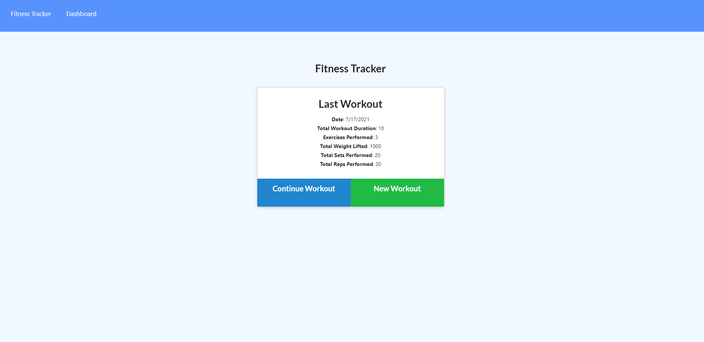

# Fitness Tracker

## Description
I added express routing and utilized mongodb to store information regarding workouts. With this fitness tracker, you are able to store multiple workouts and track them. It is also supported visually with a chart.

## How to Use

Users are able to use this app by accessing it through the link provided below. Users are then able to select cardio or resistance work, the type of exercise, the amount of miles or resistance, duration or reps, and minutes or sets. Users are able to add multiple workouts. All the information is stored in MongoDB Atlas, and is then pulled to create a chart under the Dashboard Menu.

## To Do List
1. More responsive create button - not UX friendly

## Tools Used
Express Routes
MongoDB

## Access

Users can access the application via the Heroku Link. Users may view the code via Github.

https://github.com/vegaryanneil/hw-17-fitness-tracker

https://ancient-meadow-01882.herokuapp.com/?id=60f25cc22e97da0015f54b16

## Resources

Week 17 Activities and Mini-Project
